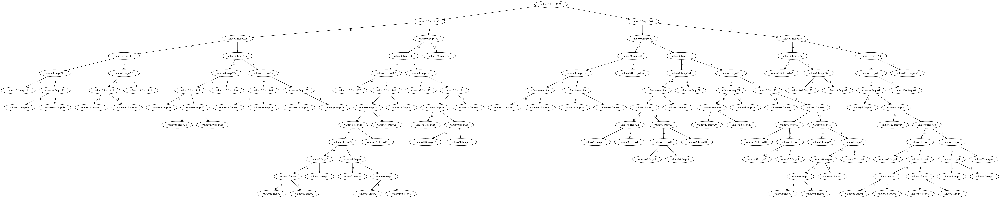

# Reductor

A lossless compressor combining LZ and Huffman Coding.

## Quickstart

```sh
> go build .
> ./reductor
Usage: ./reductor [OPTIONS] <filename>
  -compress
        run the program in compression mode (default true)
  -cpuprofile string
        write cpu profile to file
  -graphviz string
        write graphviz huffman tree representation to file
  -lz string
        write lz representation to file
  -max-match uint
        maximum match size for LZ algorithm (upper limit is 255) (default 255)
  -min-match uint
        minimum match size for LZ algorithm (default 4)
  -name string
        name for the file with compressed data
  -search-size uint
        size of the search window of LZ algorithm (upper limit is 65535) (default 4096)
  -verbose
        display log messages
```

Providing it with just a path will create `<old-filename>.reduced` compressed file.
Lets compress the executable itself:
```sh
> ./reductor -verbose reductor
2022/01/19 00:09:35 Running ./reductor in verbose mode
2022/01/19 00:09:35 Compress: reductor
2022/01/19 00:09:35 Config: min-match=4, max-match=255, search-size=4096
2022/01/19 00:09:35 Input size(bytes): 2378496
2022/01/19 00:09:42 Time elapsed: 7.089495207s
2022/01/19 00:09:42 Compression ratio: 1.41
> ls
...
-rwxrwxr-x 1 antoni antoni 2378496 sty 19 00:02 reductor
-rw-rw-r-- 1 antoni antoni 1684775 sty 19 00:09 reductor.reduced
...
```
Now, lets decompress it:
```sh
> ./reductor -compress=false reductor.reduced
> ls
...
-rwxrwxr-x 1 antoni antoni 2378496 sty 19 00:02 reductor
-rw-rw-r-- 1 antoni antoni 1684775 sty 19 00:09 reductor.reduced
-rw-rw-r-- 1 antoni antoni 2378496 sty 19 00:10 reductor.unreduced
...
```

## Visualisations

The compressor allows to visualize what happens under the hood.
It can dump LZ encoded representation to a file via `--lz <filename>`.
In this representation LZ "pointers" are symbolicly representad as `<distance,length>`.
Beginning of LZ representation for compressing this README contents is as follows:

```txt
# Reductor

A lossless compressor<11,4>bining LZ and Huffman Coding.

```sh
> go build .
> ./r<89,7> --help
Usage of<27,11>:
  -<108,8>
    <4,4>run the program in<144,9>ion mode (default true)<71,5>puprofile string<80,9>write cpu<82,4><33,5>to <41,4><126,4>graphviz<53,22><30,9>h<245,7>tree re<285,4>entat<145,4><78,11>lz77<127,22><26,5><57,26>max-match uint<267,9>maximum <27,6>size for LZ77 algorithm (upper limit is 255)<290,10><14,4><99,5>in<99,21>in<99,36><368,8>4<365,5>nam<359,17><20,5><158,4><444,4><392,5>with<587,9>ed data<498,4>search-<207,5><239,13><225,5>of<510,5><37,6> window<567,4><245,31>6553<247,12>4096<537,5>verbos<493,4><609,6>display log mes<662,4>s<708,4>
```

It can also dump Huffman Tree generated during compression (in DOT format) via `--graphviz <filename>`.
For a tree generated compressing this file (with LZ coding turned off) it looks like below. Notice
that bytes are represented by numbers, because we get outside of readable ASCII range in the tree.



## Performance assesment

File | Size | Comp Ratio - Gzip | Comp/Decomp Time - Gzip | Comp Ratio - reductor | Comp/Decom time - reductor
--- | --- | --- | --- | --- | ---
enwik | 1Gb | 3.09 | 45.64s/8.47s | 2.11 | 1h105s/193s
log18MB.txt | 18Mb | 1027 | 101ms/100ms | 290 | 63.71s/78ms
random1MB.txt | 1Mb | 0.99 | 37ms/12ms | 0.89 | 9.5s/327ms
yellowsub.txt | 1.5Kb | 2.90 | 2ms/2ms | 1.80 | 3.2ms/0.48ms
singlechar.txt | 2bytes | 0.05 | 1ms/1ms | 0.33 | 0.07/0.06ms
reductor | 2.5Mb | 1.81 | 126ms/28ms | 1.45 | 13.91/530m
